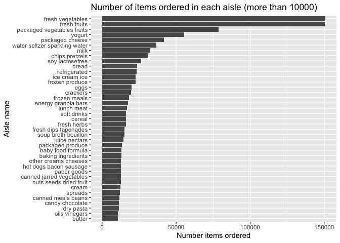
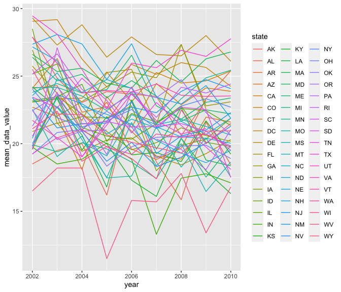

P8105 Homework 3 \[td2704\]
================

## Problem 1

``` r
data("instacart")
```

``` r
instacart
```

    ## # A tibble: 1,384,617 × 15
    ##    order_id product_id add_to_cart_order reordered user_id eval_set order_number
    ##       <int>      <int>             <int>     <int>   <int> <chr>           <int>
    ##  1        1      49302                 1         1  112108 train               4
    ##  2        1      11109                 2         1  112108 train               4
    ##  3        1      10246                 3         0  112108 train               4
    ##  4        1      49683                 4         0  112108 train               4
    ##  5        1      43633                 5         1  112108 train               4
    ##  6        1      13176                 6         0  112108 train               4
    ##  7        1      47209                 7         0  112108 train               4
    ##  8        1      22035                 8         1  112108 train               4
    ##  9       36      39612                 1         0   79431 train              23
    ## 10       36      19660                 2         1   79431 train              23
    ## # … with 1,384,607 more rows, and 8 more variables: order_dow <int>,
    ## #   order_hour_of_day <int>, days_since_prior_order <int>, product_name <chr>,
    ## #   aisle_id <int>, department_id <int>, aisle <chr>, department <chr>

### Describing the instacart dataset.

The instacart dataset has 1384617 rows of 15 variables: order\_id,
product\_id, add\_to\_cart\_order, reordered, user\_id, eval\_set,
order\_number, order\_dow, order\_hour\_of\_day,
days\_since\_prior\_order, product\_name, aisle\_id, department\_id,
aisle, department. It is a tibble that lists products in each order with
an associated order\_number and user\_id, along with other order info
such as when they last ordered and what time this order was placed. It
covers a range of 39123 products in 21 departments from 131209 orders by
131209 users. For example, the first row of the dataset describes
Bulgarian Yogurt from order 1 by user 112108; it is described to be in
the yogurt aisle in the dairy eggs department. It was added to cart by
user 112108 1 time(s); and it had been 9 days since this user last
ordered. As another example of a row of data in this dataset, the 10th
row of the dataset describes Spring Water from order 36 by user 79431;
it is described to be in the water seltzer sparkling water aisle in the
beverages department. It was added to cart by user 79431 2 time(s); and
it had been 30 days since this user last ordered.

### How many aisles are there, and which aisles are the most items ordered from?

There are 134 aisles in this dataset.

``` r
aisle_info = 
  instacart %>%
  group_by(aisle, aisle_id) %>%
  count(aisle) %>%
  arrange(desc(n)) %>%
  rename(num_items_ordered = n)
  
sum(pull(aisle_info,num_items_ordered)) # to make sure we total the number of rows in dataset
```

    ## [1] 1384617

``` r
aisle_info
```

    ## # A tibble: 134 × 3
    ## # Groups:   aisle, aisle_id [134]
    ##    aisle                         aisle_id num_items_ordered
    ##    <chr>                            <int>             <int>
    ##  1 fresh vegetables                    83            150609
    ##  2 fresh fruits                        24            150473
    ##  3 packaged vegetables fruits         123             78493
    ##  4 yogurt                             120             55240
    ##  5 packaged cheese                     21             41699
    ##  6 water seltzer sparkling water      115             36617
    ##  7 milk                                84             32644
    ##  8 chips pretzels                     107             31269
    ##  9 soy lactosefree                     91             26240
    ## 10 bread                              112             23635
    ## # … with 124 more rows

It seems to be that the top 5 aisles most ordered from are fresh
vegetables, fresh fruits, packaged vegetables fruits, yogurt, packaged
cheese.

### Make a plot that shows the number of items ordered in each aisle, limiting this to aisles with more than 10000 items ordered. Arrange aisles sensibly, and organize your plot so others can read it.

We can use our aisle\_info dataframe from above for this.

``` r
aisle_info %>%
  filter(num_items_ordered > 10000) %>%
  ggplot(aes(x=num_items_ordered, y=reorder(aisle, num_items_ordered))) +
  geom_bar(stat='identity') + 
  ggtitle("Number of items ordered in each aisle (more than 10000)") +
  xlab("Number items ordered") + ylab("Aisle name")
```

<!-- -->

### Make a table showing the three most popular items in each of the aisles “baking ingredients”, “dog food care”, and “packaged vegetables fruits”. Include the number of times each item is ordered in your table.

``` r
instacart %>%
  filter(aisle == "baking ingredients" | aisle == "dog food care" | aisle == "packaged vegetables fruits") %>%
  group_by(aisle, aisle_id,product_name, product_id) %>%
  count(product_name) %>%
  rename(num_items_ordered=n) %>%
  arrange(desc(num_items_ordered)) %>%
  group_by(aisle) %>%
  slice_max(num_items_ordered,n=3) %>%
  arrange(desc(num_items_ordered)) %>%
  knitr::kable()
```

| aisle                      | aisle\_id | product\_name                                 | product\_id | num\_items\_ordered |
|:---------------------------|----------:|:----------------------------------------------|------------:|--------------------:|
| packaged vegetables fruits |       123 | Organic Baby Spinach                          |       21903 |                9784 |
| packaged vegetables fruits |       123 | Organic Raspberries                           |       27966 |                5546 |
| packaged vegetables fruits |       123 | Organic Blueberries                           |       39275 |                4966 |
| baking ingredients         |        17 | Light Brown Sugar                             |       23537 |                 499 |
| baking ingredients         |        17 | Pure Baking Soda                              |       23405 |                 387 |
| baking ingredients         |        17 | Cane Sugar                                    |       49533 |                 336 |
| dog food care              |        40 | Snack Sticks Chicken & Rice Recipe Dog Treats |         722 |                  30 |
| dog food care              |        40 | Organix Chicken & Brown Rice Recipe           |       23329 |                  28 |
| dog food care              |        40 | Small Dog Biscuits                            |       17471 |                  26 |

### Make a table showing the mean hour of the day at which Pink Lady Apples and Coffee Ice Cream are ordered on each day of the week; format this table for human readers (i.e. produce a 2 x 7 table).

``` r
instacart %>%
  filter(product_name == "Pink Lady Apples" | product_name == "Coffee Ice Cream") %>%
  select(product_name,product_id,order_dow,order_hour_of_day) %>%
  group_by(product_name, product_id, order_dow) %>%
  summarize(mean_hour_of_day = mean(order_hour_of_day,
                                    .groups=c(product_name, product_id, order_dow))) %>%
  pivot_wider(
    names_from=order_dow,
    values_from=mean_hour_of_day) %>%
  knitr::kable(digits=2)
```

    ## `summarise()` has grouped output by 'product_name', 'product_id'. You can override using the `.groups` argument.

| product\_name    | product\_id |     0 |     1 |     2 |     3 |     4 |     5 |     6 |
|:-----------------|------------:|------:|------:|------:|------:|------:|------:|------:|
| Coffee Ice Cream |       17334 | 13.77 | 14.32 | 15.38 | 15.32 | 15.22 | 12.26 | 13.83 |
| Pink Lady Apples |        3798 | 13.44 | 11.36 | 11.70 | 14.25 | 11.55 | 12.78 | 11.94 |

## Problem 2

``` r
data("brfss_smart2010")
```

``` r
brfss_smart2010
```

    ## # A tibble: 134,203 × 23
    ##     Year Locationabbr Locationdesc  Class  Topic Question   Response Sample_Size
    ##    <int> <chr>        <chr>         <chr>  <chr> <chr>      <chr>          <int>
    ##  1  2010 AL           AL - Jeffers… Healt… Over… How is yo… Excelle…          94
    ##  2  2010 AL           AL - Jeffers… Healt… Over… How is yo… Very go…         148
    ##  3  2010 AL           AL - Jeffers… Healt… Over… How is yo… Good             208
    ##  4  2010 AL           AL - Jeffers… Healt… Over… How is yo… Fair             107
    ##  5  2010 AL           AL - Jeffers… Healt… Over… How is yo… Poor              45
    ##  6  2010 AL           AL - Jeffers… Healt… Fair… Health St… Good or…         450
    ##  7  2010 AL           AL - Jeffers… Healt… Fair… Health St… Fair or…         152
    ##  8  2010 AL           AL - Jeffers… Healt… Heal… Do you ha… Yes              524
    ##  9  2010 AL           AL - Jeffers… Healt… Heal… Do you ha… No                77
    ## 10  2010 AL           AL - Jeffers… Healt… Unde… Adults ag… Yes              316
    ## # … with 134,193 more rows, and 15 more variables: Data_value <dbl>,
    ## #   Confidence_limit_Low <dbl>, Confidence_limit_High <dbl>,
    ## #   Display_order <int>, Data_value_unit <chr>, Data_value_type <chr>,
    ## #   Data_Value_Footnote_Symbol <chr>, Data_Value_Footnote <chr>,
    ## #   DataSource <chr>, ClassId <chr>, TopicId <chr>, LocationID <chr>,
    ## #   QuestionID <chr>, RESPID <chr>, GeoLocation <chr>

### Some data cleaning for BRFSS dataset.

``` r
brfss = 
  brfss_smart2010 %>%
  janitor::clean_names() %>%
  filter(topic=="Overall Health") %>%
  mutate(
    response = factor(response, levels = c("Poor", "Fair", "Good", "Very good", "Excellent"))
  ) %>%
  rename(state = locationabbr) %>%
  rename(location = locationdesc)

# unique(pull(brfss,response)), responses already exist only from Excellent to Poor

brfss
```

    ## # A tibble: 10,625 × 23
    ##     year state location   class  topic question  response sample_size data_value
    ##    <int> <chr> <chr>      <chr>  <chr> <chr>     <fct>          <int>      <dbl>
    ##  1  2010 AL    AL - Jeff… Healt… Over… How is y… Excelle…          94       18.9
    ##  2  2010 AL    AL - Jeff… Healt… Over… How is y… Very go…         148       30  
    ##  3  2010 AL    AL - Jeff… Healt… Over… How is y… Good             208       33.1
    ##  4  2010 AL    AL - Jeff… Healt… Over… How is y… Fair             107       12.5
    ##  5  2010 AL    AL - Jeff… Healt… Over… How is y… Poor              45        5.5
    ##  6  2010 AL    AL - Mobi… Healt… Over… How is y… Excelle…          91       15.6
    ##  7  2010 AL    AL - Mobi… Healt… Over… How is y… Very go…         177       31.3
    ##  8  2010 AL    AL - Mobi… Healt… Over… How is y… Good             224       31.2
    ##  9  2010 AL    AL - Mobi… Healt… Over… How is y… Fair             120       15.5
    ## 10  2010 AL    AL - Mobi… Healt… Over… How is y… Poor              66        6.4
    ## # … with 10,615 more rows, and 14 more variables: confidence_limit_low <dbl>,
    ## #   confidence_limit_high <dbl>, display_order <int>, data_value_unit <chr>,
    ## #   data_value_type <chr>, data_value_footnote_symbol <chr>,
    ## #   data_value_footnote <chr>, data_source <chr>, class_id <chr>,
    ## #   topic_id <chr>, location_id <chr>, question_id <chr>, respid <chr>,
    ## #   geo_location <chr>

### In 2002, which states were observed at 7 or more locations? What about in 2010?

2002: states observed at 7 or more locations

``` r
brfss %>%
  filter(year == 2002) %>%
  group_by(state) %>%
  summarize(location_count = n_distinct(location)) %>%
  filter(location_count >= 7) %>%
  knitr::kable()
```

| state | location\_count |
|:------|----------------:|
| CT    |               7 |
| FL    |               7 |
| MA    |               8 |
| NC    |               7 |
| NJ    |               8 |
| PA    |              10 |

2010: states observed at 7 or more locations

``` r
brfss %>%
  filter(year == 2010) %>%
  group_by(state) %>%
  summarize(location_count = n_distinct(location)) %>%
  filter(location_count >= 7) %>%
  knitr::kable()
```

| state | location\_count |
|:------|----------------:|
| CA    |              12 |
| CO    |               7 |
| FL    |              41 |
| MA    |               9 |
| MD    |              12 |
| NC    |              12 |
| NE    |              10 |
| NJ    |              19 |
| NY    |               9 |
| OH    |               8 |
| PA    |               7 |
| SC    |               7 |
| TX    |              16 |
| WA    |              10 |

### Construct a dataset that is limited to Excellent responses, and contains, year, state, and a variable that averages the data\_value across locations within a state.

``` r
data_value_overyears_df = 
  brfss %>%
  filter(response == "Excellent") %>%
  group_by(year, state) %>%
  summarize(
    mean_data_value = mean(data_value))  %>%
  select(year, state, mean_data_value)
```

    ## `summarise()` has grouped output by 'year'. You can override using the `.groups` argument.

``` r
data_value_overyears_df
```

    ## # A tibble: 443 × 3
    ## # Groups:   year [9]
    ##     year state mean_data_value
    ##    <int> <chr>           <dbl>
    ##  1  2002 AK               27.9
    ##  2  2002 AL               18.5
    ##  3  2002 AR               24.1
    ##  4  2002 AZ               24.1
    ##  5  2002 CA               22.7
    ##  6  2002 CO               23.1
    ##  7  2002 CT               29.1
    ##  8  2002 DC               29.3
    ##  9  2002 DE               20.9
    ## 10  2002 FL               25.7
    ## # … with 433 more rows

Make a “spaghetti” plot of this average value over time within a state
(that is, make a plot showing a line for each state across years – the
geom\_line geometry and group aesthetic will help).

``` r
data_value_overyears_df %>%
  ggplot(aes(x=year,y=mean_data_value)) +
  geom_line(aes(group=state,color=state))
```

    ## Warning: Removed 3 row(s) containing missing values (geom_path).


