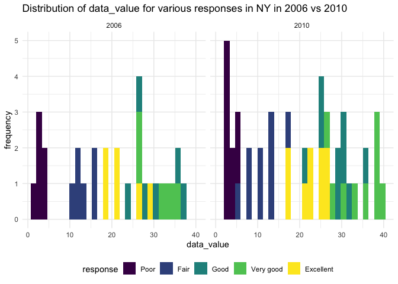

P8105 Homework 3 \[td2704\]
================

``` r
theme_set(theme_minimal() + theme(legend.position = "bottom"))
options(
  ggplot2.continuous.colour = "viridis",
  ggplot2.continuous.fill = "viridis"
)
scale_colour_discrete = scale_color_viridis_d
scale_fill_discrete = scale_fill_viridis_d
```

## Problem 1

``` r
data("instacart")
```

``` r
instacart
```

    ## # A tibble: 1,384,617 × 15
    ##    order_id product_id add_to_cart_order reordered user_id eval_set order_number
    ##       <int>      <int>             <int>     <int>   <int> <chr>           <int>
    ##  1        1      49302                 1         1  112108 train               4
    ##  2        1      11109                 2         1  112108 train               4
    ##  3        1      10246                 3         0  112108 train               4
    ##  4        1      49683                 4         0  112108 train               4
    ##  5        1      43633                 5         1  112108 train               4
    ##  6        1      13176                 6         0  112108 train               4
    ##  7        1      47209                 7         0  112108 train               4
    ##  8        1      22035                 8         1  112108 train               4
    ##  9       36      39612                 1         0   79431 train              23
    ## 10       36      19660                 2         1   79431 train              23
    ## # … with 1,384,607 more rows, and 8 more variables: order_dow <int>,
    ## #   order_hour_of_day <int>, days_since_prior_order <int>, product_name <chr>,
    ## #   aisle_id <int>, department_id <int>, aisle <chr>, department <chr>

### Describing the instacart dataset.

The instacart dataset has 1384617 rows of 15 variables: order\_id,
product\_id, add\_to\_cart\_order, reordered, user\_id, eval\_set,
order\_number, order\_dow, order\_hour\_of\_day,
days\_since\_prior\_order, product\_name, aisle\_id, department\_id,
aisle, department. It is a tibble that lists products in each order with
an associated order\_number and user\_id, along with other order info
such as when they last ordered and what time this order was placed. It
covers a range of 39123 products in 21 departments from 131209 orders by
131209 users. For example, the first row of the dataset describes
Bulgarian Yogurt from order 1 by user 112108; it is described to be in
the yogurt aisle in the dairy eggs department. It was added to cart by
user 112108 1 time(s); and it had been 9 days since this user last
ordered. As another example of a row of data in this dataset, the 10th
row of the dataset describes Spring Water from order 36 by user 79431;
it is described to be in the water seltzer sparkling water aisle in the
beverages department. It was added to cart by user 79431 2 time(s); and
it had been 30 days since this user last ordered.

### How many aisles are there, and which aisles are the most items ordered from?

There are 134 aisles in this dataset.

``` r
aisle_info = 
  instacart %>%
  group_by(aisle, aisle_id) %>%
  count(aisle) %>%
  arrange(desc(n)) %>%
  rename(num_items_ordered = n)
  
sum(pull(aisle_info,num_items_ordered)) # to make sure we total the number of rows in dataset
```

    ## [1] 1384617

``` r
aisle_info
```

    ## # A tibble: 134 × 3
    ## # Groups:   aisle, aisle_id [134]
    ##    aisle                         aisle_id num_items_ordered
    ##    <chr>                            <int>             <int>
    ##  1 fresh vegetables                    83            150609
    ##  2 fresh fruits                        24            150473
    ##  3 packaged vegetables fruits         123             78493
    ##  4 yogurt                             120             55240
    ##  5 packaged cheese                     21             41699
    ##  6 water seltzer sparkling water      115             36617
    ##  7 milk                                84             32644
    ##  8 chips pretzels                     107             31269
    ##  9 soy lactosefree                     91             26240
    ## 10 bread                              112             23635
    ## # … with 124 more rows

It seems that the top 5 aisles most ordered from are fresh vegetables,
fresh fruits, packaged vegetables fruits, yogurt, packaged cheese.

### Make a plot that shows the number of items ordered in each aisle, limiting this to aisles with more than 10000 items ordered. Arrange aisles sensibly, and organize your plot so others can read it.

We can use our aisle\_info dataframe from above for this.

``` r
aisle_info %>%
  filter(num_items_ordered > 10000) %>%
  ggplot(aes(x=num_items_ordered, y=reorder(aisle, num_items_ordered))) +
  geom_bar(stat='identity') + 
  ggtitle("Number of items ordered in each aisle (more than 10000)") +
  xlab("Number items ordered") + ylab("Aisle name")
```

<!-- -->

As we can see, only 4 aisles have more than 50000 orders: fresh
vegetables, fresh fruits, packaged vegetables fruits, and yogurt. There
are 39 aisles total that have more than 10000 items ordered.

### Make a table showing the three most popular items in each of the aisles “baking ingredients”, “dog food care”, and “packaged vegetables fruits”. Include the number of times each item is ordered in your table.

``` r
instacart %>%
  filter(aisle == "baking ingredients" | aisle == "dog food care" | aisle == "packaged vegetables fruits") %>%
  group_by(aisle, aisle_id,product_name, product_id) %>%
  count(product_name) %>%
  rename(num_items_ordered=n) %>%
  arrange(desc(num_items_ordered)) %>%
  group_by(aisle) %>%
  slice_max(num_items_ordered,n=3) %>%
  arrange(desc(num_items_ordered)) %>%
  knitr::kable()
```

| aisle                      | aisle\_id | product\_name                                 | product\_id | num\_items\_ordered |
|:---------------------------|----------:|:----------------------------------------------|------------:|--------------------:|
| packaged vegetables fruits |       123 | Organic Baby Spinach                          |       21903 |                9784 |
| packaged vegetables fruits |       123 | Organic Raspberries                           |       27966 |                5546 |
| packaged vegetables fruits |       123 | Organic Blueberries                           |       39275 |                4966 |
| baking ingredients         |        17 | Light Brown Sugar                             |       23537 |                 499 |
| baking ingredients         |        17 | Pure Baking Soda                              |       23405 |                 387 |
| baking ingredients         |        17 | Cane Sugar                                    |       49533 |                 336 |
| dog food care              |        40 | Snack Sticks Chicken & Rice Recipe Dog Treats |         722 |                  30 |
| dog food care              |        40 | Organix Chicken & Brown Rice Recipe           |       23329 |                  28 |
| dog food care              |        40 | Small Dog Biscuits                            |       17471 |                  26 |

The top 3 items ordered in each of these categories are shown above.
Among these, the number of items ordered from the packaged vegetables
fruits aisle are much higher than the other two aisles, baking
ingredients and dog food care. Items ordered in dog food care aisle are
much lower in quantity ordered than the other aisles, but the 3 items
showed are their most popular.

### Make a table showing the mean hour of the day at which Pink Lady Apples and Coffee Ice Cream are ordered on each day of the week; format this table for human readers (i.e. produce a 2 x 7 table).

``` r
instacart %>%
  filter(product_name == "Pink Lady Apples" | product_name == "Coffee Ice Cream") %>%
  select(product_name,product_id,order_dow,order_hour_of_day) %>%
  group_by(product_name, product_id, order_dow) %>%
  summarize(mean_hour_of_day = mean(order_hour_of_day,
                                    .groups=c(product_name, product_id, order_dow))) %>%
  pivot_wider(
    names_from=order_dow,
    values_from=mean_hour_of_day) %>%
  knitr::kable(digits=2)
```

    ## `summarise()` has grouped output by 'product_name', 'product_id'. You can override using the `.groups` argument.

| product\_name    | product\_id |     0 |     1 |     2 |     3 |     4 |     5 |     6 |
|:-----------------|------------:|------:|------:|------:|------:|------:|------:|------:|
| Coffee Ice Cream |       17334 | 13.77 | 14.32 | 15.38 | 15.32 | 15.22 | 12.26 | 13.83 |
| Pink Lady Apples |        3798 | 13.44 | 11.36 | 11.70 | 14.25 | 11.55 | 12.78 | 11.94 |

Overall, it seems that Coffee Ice Cream is ordered at a later hour on
average than Pink Lady Apples are ordered, as the mean order hour of day
on each day of the week is greater for Coffee Ice Cream every day except
day 5, where the mean order hours are roughly the same.

## Problem 2

``` r
data("brfss_smart2010")
```

``` r
brfss_smart2010
```

    ## # A tibble: 134,203 × 23
    ##     Year Locationabbr Locationdesc  Class  Topic Question   Response Sample_Size
    ##    <int> <chr>        <chr>         <chr>  <chr> <chr>      <chr>          <int>
    ##  1  2010 AL           AL - Jeffers… Healt… Over… How is yo… Excelle…          94
    ##  2  2010 AL           AL - Jeffers… Healt… Over… How is yo… Very go…         148
    ##  3  2010 AL           AL - Jeffers… Healt… Over… How is yo… Good             208
    ##  4  2010 AL           AL - Jeffers… Healt… Over… How is yo… Fair             107
    ##  5  2010 AL           AL - Jeffers… Healt… Over… How is yo… Poor              45
    ##  6  2010 AL           AL - Jeffers… Healt… Fair… Health St… Good or…         450
    ##  7  2010 AL           AL - Jeffers… Healt… Fair… Health St… Fair or…         152
    ##  8  2010 AL           AL - Jeffers… Healt… Heal… Do you ha… Yes              524
    ##  9  2010 AL           AL - Jeffers… Healt… Heal… Do you ha… No                77
    ## 10  2010 AL           AL - Jeffers… Healt… Unde… Adults ag… Yes              316
    ## # … with 134,193 more rows, and 15 more variables: Data_value <dbl>,
    ## #   Confidence_limit_Low <dbl>, Confidence_limit_High <dbl>,
    ## #   Display_order <int>, Data_value_unit <chr>, Data_value_type <chr>,
    ## #   Data_Value_Footnote_Symbol <chr>, Data_Value_Footnote <chr>,
    ## #   DataSource <chr>, ClassId <chr>, TopicId <chr>, LocationID <chr>,
    ## #   QuestionID <chr>, RESPID <chr>, GeoLocation <chr>

### Some data cleaning for BRFSS dataset.

``` r
brfss = 
  brfss_smart2010 %>%
  janitor::clean_names() %>%
  filter(topic=="Overall Health") %>%
  mutate(
    response = factor(response, levels = c("Poor", "Fair", "Good", "Very good", "Excellent"))
  ) %>%
  rename(state = locationabbr) %>%
  rename(location = locationdesc)

# unique(pull(brfss,response)), responses already exist only from Excellent to Poor

brfss
```

    ## # A tibble: 10,625 × 23
    ##     year state location   class  topic question  response sample_size data_value
    ##    <int> <chr> <chr>      <chr>  <chr> <chr>     <fct>          <int>      <dbl>
    ##  1  2010 AL    AL - Jeff… Healt… Over… How is y… Excelle…          94       18.9
    ##  2  2010 AL    AL - Jeff… Healt… Over… How is y… Very go…         148       30  
    ##  3  2010 AL    AL - Jeff… Healt… Over… How is y… Good             208       33.1
    ##  4  2010 AL    AL - Jeff… Healt… Over… How is y… Fair             107       12.5
    ##  5  2010 AL    AL - Jeff… Healt… Over… How is y… Poor              45        5.5
    ##  6  2010 AL    AL - Mobi… Healt… Over… How is y… Excelle…          91       15.6
    ##  7  2010 AL    AL - Mobi… Healt… Over… How is y… Very go…         177       31.3
    ##  8  2010 AL    AL - Mobi… Healt… Over… How is y… Good             224       31.2
    ##  9  2010 AL    AL - Mobi… Healt… Over… How is y… Fair             120       15.5
    ## 10  2010 AL    AL - Mobi… Healt… Over… How is y… Poor              66        6.4
    ## # … with 10,615 more rows, and 14 more variables: confidence_limit_low <dbl>,
    ## #   confidence_limit_high <dbl>, display_order <int>, data_value_unit <chr>,
    ## #   data_value_type <chr>, data_value_footnote_symbol <chr>,
    ## #   data_value_footnote <chr>, data_source <chr>, class_id <chr>,
    ## #   topic_id <chr>, location_id <chr>, question_id <chr>, respid <chr>,
    ## #   geo_location <chr>

### In 2002, which states were observed at 7 or more locations? What about in 2010?

2002: states observed at 7 or more locations

``` r
state_location_count_2002_7plus = 
  brfss %>%
  filter(year == 2002) %>%
  group_by(state) %>%
  summarize(location_count = n_distinct(location)) %>%
  filter(location_count >= 7)
  
state_location_count_2002_7plus  %>%
  knitr::kable()
```

| state | location\_count |
|:------|----------------:|
| CT    |               7 |
| FL    |               7 |
| MA    |               8 |
| NC    |               7 |
| NJ    |               8 |
| PA    |              10 |

States observed at 7 or more locations in 2002 are CT, FL, MA, NC, NJ,
PA. The state with the most observed locations in 2002 was PA at 10
locations.

2010: states observed at 7 or more locations

``` r
state_location_count_2010_7plus = 
  brfss %>%
  filter(year == 2010) %>%
  group_by(state) %>%
  summarize(location_count = n_distinct(location)) %>%
  filter(location_count >= 7) 

state_location_count_2010_7plus %>%
  knitr::kable()
```

| state | location\_count |
|:------|----------------:|
| CA    |              12 |
| CO    |               7 |
| FL    |              41 |
| MA    |               9 |
| MD    |              12 |
| NC    |              12 |
| NE    |              10 |
| NJ    |              19 |
| NY    |               9 |
| OH    |               8 |
| PA    |               7 |
| SC    |               7 |
| TX    |              16 |
| WA    |              10 |

States observed at 7 or more locations in 2010 are CA, CO, FL, MA, MD,
NC, NE, NJ, NY, OH, PA, SC, TX, WA. The state with the most observed
locations in 2010 was FL at 41 locations.

### Construct a dataset that is limited to Excellent responses, and contains, year, state, and a variable that averages the data\_value across locations within a state.

``` r
data_value_overyears_df = 
  brfss %>%
  filter(response == "Excellent") %>%
  group_by(year, state) %>%
  summarize(
    mean_data_value = mean(data_value))  %>%
  select(year, state, mean_data_value)
```

    ## `summarise()` has grouped output by 'year'. You can override using the `.groups` argument.

``` r
data_value_overyears_df
```

    ## # A tibble: 443 × 3
    ## # Groups:   year [9]
    ##     year state mean_data_value
    ##    <int> <chr>           <dbl>
    ##  1  2002 AK               27.9
    ##  2  2002 AL               18.5
    ##  3  2002 AR               24.1
    ##  4  2002 AZ               24.1
    ##  5  2002 CA               22.7
    ##  6  2002 CO               23.1
    ##  7  2002 CT               29.1
    ##  8  2002 DC               29.3
    ##  9  2002 DE               20.9
    ## 10  2002 FL               25.7
    ## # … with 433 more rows

Make a “spaghetti” plot of this average value over time within a state
(that is, make a plot showing a line for each state across years – the
geom\_line geometry and group aesthetic will help).

``` r
data_value_overyears_df %>%
  ggplot(aes(x=year,y=mean_data_value)) +
  geom_line(aes(group=state,color=state)) +
  ggtitle("Mean data value over the years across states for 'Excellent' response")
```

    ## Warning: Removed 3 row(s) containing missing values (geom_path).


Above, we have lines for each state representing mean data value over
the years from 2002 to 2010. With all the states on here, it makes it
slightly difficult to observe trends. If I were to make a comment, it
seems like the overall mean\_data\_value does flow downward for many
states, like from 2002 to 2004, as the range of values is smaller at
2004 than it is at 2002, and then the values slightly trend upwards
after that. Other than 2 states at some years, the overall
mean\_data\_values over this period seem to range between 15 and 30.

### Make a two-panel plot showing, for the years 2006, and 2010, distribution of data\_value for responses (“Poor” to “Excellent”) among locations in NY State

``` r
# brfss %>%
#   filter(state == "NY") %>%
#   filter(year == 2006 | year == 2010) %>%
#   ggplot(aes(x=response,y=data_value,fill=year)) + 
#   geom_point() + 
#   facet_grid(. ~ year) +
#   ggtitle("Distribution of data_value for various responses in NY in 2006 vs 2010") +
#   xlab("Response") + ylab("data_value") + 
#   theme(legend.position = "none")

brfss %>%
  filter(state == "NY") %>%
  filter(year == 2006 | year == 2010) %>%
  ggplot(aes(x=data_value)) + 
  geom_histogram(aes(fill=response)) + 
  facet_grid(. ~ year) +
  ggtitle("Distribution of data_value for various responses in NY in 2006 vs 2010") +
  xlab("data_value") + ylab("frequency")
```

    ## `stat_bin()` using `bins = 30`. Pick better value with `binwidth`.

<!-- --> A
density plot may be easier to parse than the histogram above when
looking at distribution of data\_value values.

``` r
brfss %>%
  filter(state == "NY") %>%
  filter(year == 2006 | year == 2010) %>%
  ggplot(aes(x=data_value,fill=response)) + 
  geom_density(alpha = .4) + 
  facet_grid(rows = vars(year)) +
  ggtitle("Distribution of data_value for various responses in NY in 2006 vs 2010") +
  xlab("data_value") + ylab("density")
```

<!-- -->

Here, we see different peaks for different responses. For the poor
response, the data\_values are concentrated between values 0 to 5. For
the fair response, data\_values concentrate around 10-15. Interestingly,
for the excellent response, data\_values concentrate around the middle
values, although values tend to be higher in 2010 than in 2006. Very
good values tend to be higher in 2010 than 2006, while both tend to have
the highest values compared to other responses in the 35 to 40 range.
The good response seems to have no true peak of values in 2006, but a
peak around 30 in 2010.

## Problem 3

Load, tidy, and otherwise wrangle the data. Your final dataset should
include all originally observed variables and values; have useful
variable names; include a weekday vs weekend variable; and encode data
with reasonable variable classes.

``` r
accel_df = 
  read_csv("data/accel_data.csv") %>%
  janitor::clean_names() %>%
  mutate(
    weekend = (day == "Saturday"  | day == "Sunday"),
    day_of_week = (case_when(
      day == "Monday" ~ 1,
      day == "Tuesday" ~ 2,
      day == "Wednesday" ~ 3,
      day == "Thursday" ~ 4,
      day == "Friday" ~ 5,
      day == "Saturday" ~ 6,
      day == "Sunday" ~ 7
    ))
  ) %>%
  relocate(week, day_id, day, weekend, day_of_week)
```

    ## Rows: 35 Columns: 1443

    ## ── Column specification ────────────────────────────────────────────────────────
    ## Delimiter: ","
    ## chr    (1): day
    ## dbl (1442): week, day_id, activity.1, activity.2, activity.3, activity.4, ac...

    ## 
    ## ℹ Use `spec()` to retrieve the full column specification for this data.
    ## ℹ Specify the column types or set `show_col_types = FALSE` to quiet this message.

``` r
accel_df
```

    ## # A tibble: 35 × 1,445
    ##     week day_id day       weekend day_of_week activity_1 activity_2 activity_3
    ##    <dbl>  <dbl> <chr>     <lgl>         <dbl>      <dbl>      <dbl>      <dbl>
    ##  1     1      1 Friday    FALSE             5       88.4       82.2       64.4
    ##  2     1      2 Monday    FALSE             1        1          1          1  
    ##  3     1      3 Saturday  TRUE              6        1          1          1  
    ##  4     1      4 Sunday    TRUE              7        1          1          1  
    ##  5     1      5 Thursday  FALSE             4       47.4       48.8       46.9
    ##  6     1      6 Tuesday   FALSE             2       64.8       59.5       73.7
    ##  7     1      7 Wednesday FALSE             3       71.1      103.        68.5
    ##  8     2      8 Friday    FALSE             5      675        542       1010  
    ##  9     2      9 Monday    FALSE             1      291        335        393  
    ## 10     2     10 Saturday  TRUE              6       64         11          1  
    ## # … with 25 more rows, and 1,437 more variables: activity_4 <dbl>,
    ## #   activity_5 <dbl>, activity_6 <dbl>, activity_7 <dbl>, activity_8 <dbl>,
    ## #   activity_9 <dbl>, activity_10 <dbl>, activity_11 <dbl>, activity_12 <dbl>,
    ## #   activity_13 <dbl>, activity_14 <dbl>, activity_15 <dbl>, activity_16 <dbl>,
    ## #   activity_17 <dbl>, activity_18 <dbl>, activity_19 <dbl>, activity_20 <dbl>,
    ## #   activity_21 <dbl>, activity_22 <dbl>, activity_23 <dbl>, activity_24 <dbl>,
    ## #   activity_25 <dbl>, activity_26 <dbl>, activity_27 <dbl>, …

Describe the resulting dataset (e.g. what variables exist, how many
observations, etc)

This dataset has 35 rows, representing 7 days of accelerometer data each
for 5 weeks. It has variables for week, day\_id, day, weekend,
day\_of\_week and an additional 1440 variables for activity counts for
each of the 60 minutes of each hour in a 24 hour day. The weekend
variable is a logical variable - TRUE if the day is Saturday or Sunday,
and FALSE otherwise. The day\_of\_week variable has numbers to order the
days as they order in a week.

Traditional analyses of accelerometer data focus on the total activity
over the day. Using your tidied dataset, aggregate accross minutes to
create a total activity variable for each day, and create a table
showing these totals. Are any trends apparent?

``` r
accel_by_day_df = 
  accel_df %>%
  mutate(
    total_activity = rowSums(across(activity_1:activity_1440))
  ) %>%
  select(week, day_id, day, weekend, day_of_week, total_activity) %>%
  arrange(week, day_of_week)

accel_by_day_df
```

    ## # A tibble: 35 × 6
    ##     week day_id day       weekend day_of_week total_activity
    ##    <dbl>  <dbl> <chr>     <lgl>         <dbl>          <dbl>
    ##  1     1      2 Monday    FALSE             1         78828.
    ##  2     1      6 Tuesday   FALSE             2        307094.
    ##  3     1      7 Wednesday FALSE             3        340115.
    ##  4     1      5 Thursday  FALSE             4        355924.
    ##  5     1      1 Friday    FALSE             5        480543.
    ##  6     1      3 Saturday  TRUE              6        376254 
    ##  7     1      4 Sunday    TRUE              7        631105 
    ##  8     2      9 Monday    FALSE             1        295431 
    ##  9     2     13 Tuesday   FALSE             2        423245 
    ## 10     2     14 Wednesday FALSE             3        440962 
    ## # … with 25 more rows

We can see there are fluctuations in activity based on the day it is.
Saturdays seem to have consistently low activity counts - let’s further
look at our newly created table.

Let’s see if there are any trends by day of week.

``` r
accel_by_day_df %>%
  group_by(day_of_week,day) %>%
  summarize(
    mean_activity = mean(total_activity)
    )
```

    ## `summarise()` has grouped output by 'day_of_week'. You can override using the `.groups` argument.

    ## # A tibble: 7 × 3
    ## # Groups:   day_of_week [7]
    ##   day_of_week day       mean_activity
    ##         <dbl> <chr>             <dbl>
    ## 1           1 Monday          371740.
    ## 2           2 Tuesday         359848.
    ## 3           3 Wednesday       425954.
    ## 4           4 Thursday        418230.
    ## 5           5 Friday          458342.
    ## 6           6 Saturday        273847.
    ## 7           7 Sunday          383843.

As we can see, there seems to be the least activity on Saturdays and the
most activity on Fridays.

Let’s see if there are any trends by weekend vs weekday.

``` r
accel_by_day_df %>%
  group_by(weekend) %>%
  summarize(
    mean_activity = mean(total_activity)
    )
```

    ## # A tibble: 2 × 2
    ##   weekend mean_activity
    ##   <lgl>           <dbl>
    ## 1 FALSE         406823.
    ## 2 TRUE          328845

As we can see, there seems to be a trend of less activity on the
weekends and more activity on weekdays.

Accelerometer data allows the inspection activity over the course of the
day. Make a single-panel plot that shows the 24-hour activity time
courses for each day and use color to indicate day of the week. Describe
in words any patterns or conclusions you can make based on this graph.

``` r
accel_df %>%
  pivot_longer(
    activity_1:activity_1440,
    names_to="activity_id",
    names_prefix = "activity_",
    values_to="activity_count"
  ) %>% 
  mutate(
    activity_id = as.numeric(activity_id)
  ) %>%
  ggplot(aes(x=activity_id, y=activity_count)) +
  geom_line(aes(group=day_id,color=factor(day_of_week))) +
  labs(color='Day of the week') +
  xlab("Minutes of the day (starting at 12am)") +
  ggtitle("Activity count in a day grouped by day of the week (order: Monday to Sunday)")
```


It looks like there is more activity in the early and late afternoons on
the weekend (days 6 and 7), on Sundays in particular, perhaps the user
waking up late on weekends or going out more. And overall, the weekdays
seems to have high activity in mornings (likely when the user wakes up)
and in the evenings (around dinner and before the user goes to bed). The
activity count is lowest between roughly 1300 min to 400 min, which is
roughly 10pm to 7am, and we can assume this is when the user usually
sleeps.
